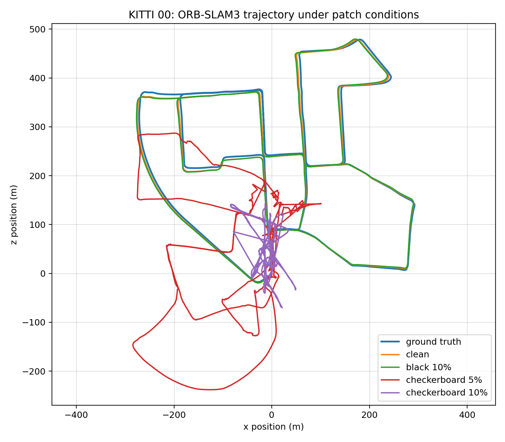
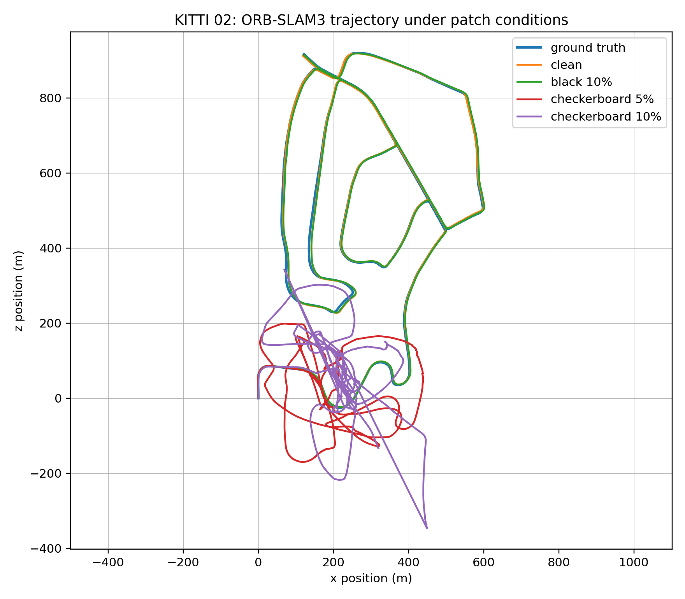

# Main Results: KITTI Patch Stress Tests Against ORB-SLAM3

## Summary

These experiments evaluate whether small digital image-plane patches can degrade ORB-SLAM3 stereo odometry on KITTI. The key comparison is between a low-texture black occlusion patch and a high-texture checkerboard patch. The black patch acts as an occlusion control, while the checkerboard patch injects many repeatable visual features that can corrupt matching and trajectory estimation.

Across KITTI 00 and KITTI 02, the black 10% top-left patch remains close to the clean baseline. In contrast, checkerboard patches produce large trajectory drift, early error onset, increased tracking/map instability, and visible trajectory deviation. This supports the central claim that the failure is not explained by simple occlusion; the damaging mechanism is high-texture feature and match corruption.

## Audited baseline results

| Condition | Runs | ATE RMSE mean ± std (m) | Translation drift mean ± std (%) |
|---|---:|---:|---:|
| KITTI 00 clean | 5 | 7.206 ± 0.472 | 0.679 ± 0.002 |
| KITTI 02 clean | 5 | 7.838 ± 0.896 | 0.754 ± 0.008 |

## Official KITTI devkit cross-check

| Condition | Translation drift (%) | Rotation drift (deg/100m) | Segments |
|---|---:|---:|---:|
| KITTI 00 clean | 0.677 | 0.252 | 3283 |
| KITTI 00 black 10% top-left | 0.668 | 0.252 | 3283 |
| KITTI 00 checkerboard 5% top-left | 40.750 | 21.115 | 3283 |
| KITTI 02 clean | 0.731 | 0.227 | 3453 |
| KITTI 02 black 10% top-left | 0.707 | 0.227 | 3453 |
| KITTI 02 checkerboard 5% top-left | 50.511 | 23.733 | 3453 |
| KITTI 02 checkerboard 10% top-left | 71.953 | 28.463 | 3453 |

## Interpretation

The official KITTI devkit results confirm the main trend found by the internal evaluator. Clean and black-patch controls remain near baseline, with translation drift below 1%. The checkerboard patches sharply increase drift, reaching 40.750% on KITTI 00 at 5% patch area and 50.511% on KITTI 02 at 5% patch area. On KITTI 02, increasing the checkerboard patch to 10% further increases translation drift to 71.953%.

The black patch result is especially important. A 10% black patch is much larger than the 5% checkerboard patch, yet it does not meaningfully degrade odometry. This weakens a simple occlusion explanation and strengthens the feature-corruption explanation.

The result should be described as a digital image-plane patch stress test, not as a physically validated adversarial patch. The strongest defensible claim is that high-texture localized perturbations can trigger severe stereo ORB-SLAM3 trajectory corruption, while low-texture occlusion controls of similar or larger size remain close to baseline.

## Trajectory visualizations

The qualitative trajectory plots support the quantitative metrics. Clean and black-patch trajectories remain close to the ground truth. Checkerboard trajectories visibly diverge, especially after early onset regions.

## Reproducibility notes

- Baselines were audited with five ORB-SLAM3 repeats on KITTI 00 and KITTI 02.
- Official KITTI devkit metrics were used as a cross-check for the main clean, black-patch, and checkerboard-patch conditions.
- KITTI 02 checkerboard trajectories with one missing final pose were padded with the last estimated pose only to satisfy the official devkit length requirement.
- The missing plotting dependencies in the KITTI devkit, such as gnuplot and pdfcrop, do not affect the numeric segment-error outputs used here.

## Caveats

These experiments use digital patches inserted into KITTI images. They do not model printing, camera optics, lighting, viewpoint changes, or physical placement. The results are therefore evidence of vulnerability under controlled digital perturbation, not proof of a physically realizable attack.

The checkerboard pattern is also a strong synthetic feature source. Future work should test less artificial high-texture patterns, real-world printed markers, different patch locations, and both-camera patch variants.
