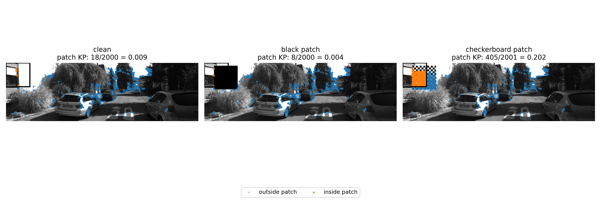

# Main Results Narrative: ORB-SLAM3 Patch Stress Test

## Core question

This experiment asks whether ORB-SLAM3 stereo fails mainly because an image patch occludes part of the scene, or because a high-texture patch corrupts feature extraction and matching.

The current evidence supports the second explanation.

## Experimental setup

- SLAM system: ORB-SLAM3 stereo
- Datasets: KITTI Odometry sequences 00 and 02
- Patch location for cross-sequence comparison: top-left
- Modified camera: left camera only
- Right camera: unchanged
- Control patch: black patch
- Attack patch: checkerboard patch
- Metrics:
  - ATE RMSE
  - KITTI-style segment translation drift
  - KITTI-style segment rotation drift
  - ORB-SLAM3 log symptoms, especially `Fail to track local map`

## Main quantitative result

| Sequence | Condition | Runs | ATE RMSE mean ± std (m) | Translation drift mean ± std (%) | Rotation drift mean ± std (deg/100m) | Fail-track mean |
|---|---|---:|---:|---:|---:|---:|
| KITTI 00 | clean | 5 | 7.206 ± 0.472 | 0.679 ± 0.002 | 0.252 ± 0.003 | 0.00 |
| KITTI 00 | black 10% top-left | 3 | 7.865 ± 0.148 | 0.661 ± 0.007 | 0.251 ± 0.002 | 0.00 |
| KITTI 00 | checkerboard 2.5% top-left | 3 | 11.260 ± 1.145 | 1.967 ± 0.134 | 0.891 ± 0.051 | 0.00 |
| KITTI 00 | checkerboard 5% top-left | 3 | 318.600 ± 159.587 | 35.341 ± 5.308 | 16.974 ± 3.716 | 4.00 |
| KITTI 00 | checkerboard 10% top-left | 3 | 286.264 ± 22.153 | 54.897 ± 6.054 | 33.345 ± 3.046 | 41.67 |
| KITTI 02 | clean | 3 | 7.511 ± 0.305 | 0.737 ± 0.006 | 0.236 ± 0.008 | 0.00 |
| KITTI 02 | black 10% top-left | 3 | 8.408 ± 0.420 | 0.722 ± 0.024 | 0.237 ± 0.013 | 0.00 |
| KITTI 02 | checkerboard 2.5% top-left | 3 | 68.614 ± 79.033 | 6.607 ± 9.743 | 1.578 ± 2.167 | 10.00 |
| KITTI 02 | checkerboard 5% top-left | 3 | 597.977 ± 123.298 | 47.107 ± 8.627 | 19.413 ± 3.760 | 19.67 |
| KITTI 02 | checkerboard 10% top-left | 3 | 576.657 ± 69.407 | 66.443 ± 6.642 | 32.650 ± 4.358 | 30.67 |

## Visual and mechanism result

### Feature concentration diagnostic

For the same KITTI 00 frame and the same 5% top-left region, the clean image contains only 18 patch-region ORB keypoints out of 2000 total keypoints, and the black patch contains only 8 out of 2000. The checkerboard patch contains 405 out of 2001 keypoints.

This means the checkerboard patch occupies 5% of the image area but attracts about 20.2% of detected ORB keypoints in this representative frame. The patch is therefore roughly four times overrepresented relative to its image area. This supports the mechanism claim that the checkerboard is not merely removing visual information; it is injecting a dense artificial feature region.

### KITTI 00 trajectory comparison

On KITTI 00, the clean trajectory and the black 10% occlusion control remain close to the ground truth. The checkerboard trajectories deviate severely from the ground truth and form geometrically inconsistent loops. This visual pattern matches the quantitative result: black occlusion remains near baseline, while checkerboard patches produce large ATE and KITTI-style drift.

### KITTI 02 trajectory comparison

On KITTI 02, the same pattern generalizes. Clean and black-patch trajectories remain close to ground truth, while checkerboard patches produce large trajectory corruption. The exact failure shape differs from KITTI 00, which suggests the effect depends on sequence geometry and scene content, but the high-level failure mode remains consistent.

## Interpretation

The black patch control stays close to the clean baseline on both KITTI 00 and KITTI 02. This weakens the explanation that the attack works simply by hiding part of the image.

The checkerboard patch behaves differently. At 5% and 10% patch area, the trajectory error becomes much larger, segment drift increases sharply, and ORB-SLAM3 begins showing internal instability through tracking failures and map events.

The keypoint diagnostic explains why. The checkerboard patch creates a dense, artificial feature region, while the black patch suppresses features. In a feature-based SLAM system, a high concentration of artificial local features can corrupt matching and geometric estimation even when the system continues to output a trajectory.

This supports a feature/match-corruption interpretation: the high-texture patch injects visually stable but geometrically misleading local structure. ORB-SLAM3 can continue producing a trajectory, but that trajectory can become severely wrong.

## Threshold behavior

The 2.5% checkerboard condition should not be overclaimed. On KITTI 00, it is only mildly worse than clean. On KITTI 02, it is unstable across repeats, with one severe run and two milder runs. This suggests an early-warning or sequence-sensitive regime, not a deterministic failure threshold.

The strongest current claim is that the failure becomes robust at 5% and 10% patch area in the tested top-left configuration.

## Paper-safe claim

Across KITTI 00 and KITTI 02, same-location black occlusion controls have little effect on ORB-SLAM3 stereo, while high-texture checkerboard patches can cause severe trajectory drift, tracking instability, and map inconsistency. This suggests the vulnerability is driven less by lost image area and more by corrupted feature/match structure.

## What not to claim yet

Do not claim this is a physical adversarial patch. These are digital image-plane stress tests.

Do not claim monotonic degradation with patch size. The results show a qualitative transition, not a clean monotonic curve.

Do not claim official KITTI benchmark performance unless the segment evaluator is cross-checked against the official KITTI odometry evaluator.

Do not claim universal failure at 2.5%. That condition is unstable and sequence-dependent.

## Next evidence needed

The next most useful addition is a small feature/match diagnostic figure: clean vs black vs checkerboard for the same frame, showing that the checkerboard attracts a disproportionate number of ORB features while the black patch does not.
