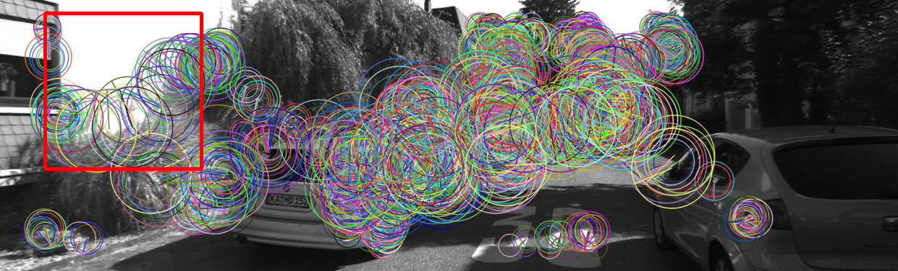
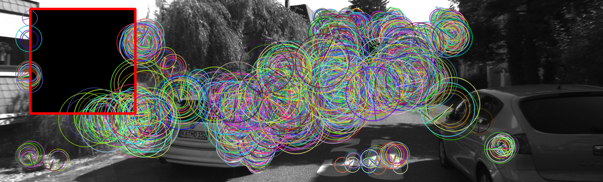
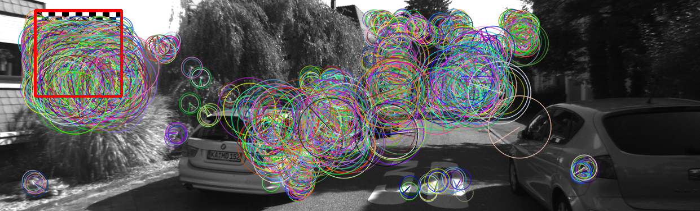
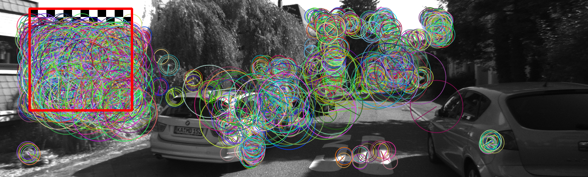
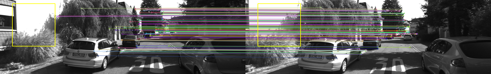
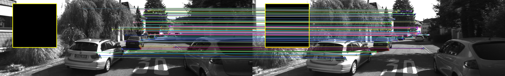
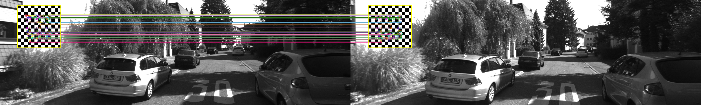
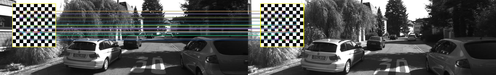

# ORB Feature and Match Mechanism Summary

## Purpose

This diagnostic supports the mechanism claim behind the KITTI patch stress-test results. The main trajectory experiments showed that a black top-left patch stays close to the clean ORB-SLAM3 baseline, while checkerboard patches cause severe trajectory drift. The mechanism question is whether the checkerboard behaves like simple occlusion or like feature injection.

The evidence here supports the feature-injection interpretation. The black patch removes local visual content and attracts almost no ORB keypoints or matches. The checkerboard patch injects dense repeatable visual structure, concentrating ORB keypoints and accepted descriptor matches inside a small image region.

## Important caveat

These diagnostics use OpenCV ORB and descriptor matching as a proxy. They are not a direct dump of ORB-SLAM3's internal frontend state. Therefore, the safe claim is not that ORB-SLAM3 internally matched exactly these points. The safe claim is that an ORB-style frontend sees the checkerboard as a dense, repeatable feature source, which supports the feature/match corruption explanation.

## Keypoint diagnostic

Across seven KITTI 00 frames, the checkerboard patch captured a disproportionate share of ORB keypoints.

| Condition | Frames | Total keypoints mean | Patch keypoints mean | % in patch mean ± std | Patch area % mean | Density ratio mean ± std |
|---|---:|---:|---:|---:|---:|---:|
| clean_reference_top_left_10pct_region | 7 | 2000.0 | 102.9 | 5.14 ± 3.86 | 10.00 | 0.51 ± 0.39 |
| black_10pct_top_left | 7 | 2000.0 | 6.4 | 0.32 ± 0.24 | 10.00 | 0.03 ± 0.02 |
| checkerboard_5pct_top_left | 7 | 2000.4 | 869.0 | 43.44 ± 0.98 | 5.02 | 8.66 ± 0.20 |
| checkerboard_10pct_top_left | 7 | 2000.4 | 1000.3 | 50.00 ± 0.74 | 10.00 | 5.00 ± 0.07 |

## Match diagnostic

Across seven adjacent KITTI 00 frame pairs, the checkerboard patch also captured a disproportionate share of accepted ORB descriptor matches.

| Condition | Pairs | Matches mean | Either patch match % mean ± std | Both patch match % mean ± std | Patch area % | Either density ratio mean ± std | Both density ratio mean ± std |
|---|---:|---:|---:|---:|---:|---:|---:|
| clean_reference_top_left_10pct_region | 7 | 2238.0 | 3.27 ± 3.42 | 2.42 ± 3.10 | 10.00 | 0.33 ± 0.34 | 0.24 ± 0.31 |
| black_10pct_top_left | 7 | 2145.3 | 0.16 ± 0.26 | 0.10 ± 0.25 | 10.00 | 0.02 ± 0.03 | 0.01 ± 0.03 |
| checkerboard_5pct_top_left | 7 | 2458.0 | 14.31 ± 2.10 | 13.59 ± 2.37 | 5.02 | 2.85 ± 0.42 | 2.71 ± 0.47 |
| checkerboard_10pct_top_left | 7 | 2576.1 | 27.98 ± 3.78 | 26.99 ± 3.96 | 10.00 | 2.80 ± 0.38 | 2.70 ± 0.40 |

## Interpretation

The black patch behaves as an occlusion control. It suppresses local ORB features and contributes almost no accepted frame-to-frame matches inside the patch region.

The checkerboard behaves differently. Even at 5% image area, it captures roughly 43% of detected ORB keypoints and about 13.6% of both-endpoint descriptor matches. At 10% area, it captures about 50% of detected ORB keypoints and about 27.0% of both-endpoint descriptor matches.

This supports the mechanism claim: the checkerboard does not primarily harm ORB-SLAM3 by hiding scene content. It harms the pipeline by injecting dense, repeatable local structure that can dominate feature extraction and perturb visual matching.

## Representative keypoint overlays

### Clean reference region

### Black 10% patch

### Checkerboard 5% patch

### Checkerboard 10% patch

## Representative match overlays

### Clean reference region

### Black 10% patch

### Checkerboard 5% patch

### Checkerboard 10% patch

## Paper-safe wording

A safe formulation is:

"To distinguish simple occlusion from feature-injection effects, we computed an ORB-style proxy diagnostic on representative KITTI frames. A black 10% patch suppressed local keypoints and contributed almost no patch-region matches, while checkerboard patches concentrated a disproportionate fraction of ORB keypoints and descriptor matches inside the patch region. This supports the interpretation that checkerboard patches corrupt the visual frontend by injecting dense repeatable features, rather than merely removing image content."

## What this does not prove

This diagnostic does not prove that every bad trajectory is caused by the exact matches shown in the overlays. It also does not replace direct ORB-SLAM3 frontend instrumentation. It is supporting mechanism evidence that explains why the black occlusion control remains near baseline while the checkerboard condition causes catastrophic drift.

## Corrected match diagnostic geometry

The ORB match diagnostic now infers the patch bounding box from clean-vs-attack image differences instead of assuming the patch begins at pixel `(0, 0)`. This matters because the patch generator places `top_left` patches with a small image margin rather than exactly at the image origin.

The corrected fixed summary is stored at:

- `experiments/orbslam3/kitti_patch_stress/results_summary/mechanism/orb_match_diagnostic_summary_fixed.md`

Representative match overlays are stored in:

- `experiments/orbslam3/kitti_patch_stress/figures/mechanism/kitti00_000120_000121_clean_orb_matches.png`
- `experiments/orbslam3/kitti_patch_stress/figures/mechanism/kitti00_000120_000121_black10_orb_matches.png`
- `experiments/orbslam3/kitti_patch_stress/figures/mechanism/kitti00_000120_000121_checkerboard5_orb_matches.png`
- `experiments/orbslam3/kitti_patch_stress/figures/mechanism/kitti00_000120_000121_checkerboard10_orb_matches.png`

The corrected diagnostic should be treated as the main match diagnostic going forward.
